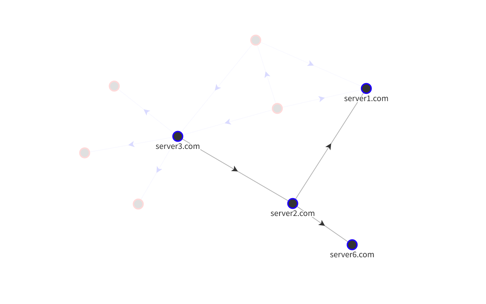

# SSH Mapper

This script is meant to help map (enumerate) ssh key networks.

The main `ssh-mapper.py` script will go through and try to ssh to the hosts in
the `ssh-hosts.txt` file as each of the users in the `ssh-users.txt` file.

## Data Visualization



I'm using a site called flourish.studio to do the actual network graphing 
/ data visualization for this project.

[Interactive Version](https://public.flourish.studio/visualisation/12290183/)

## Txt Files

The `ssh-hosts.txt` should be formatted host:port as per convention, one entry
per line.

For example:

```
example1.com:22
example2.com:2222
example3.com:12345
```

Likewise, the `ssh-users.txt` should be a new line separated list of usernames.

For example:

```
user1
user2
user3
```

## Intended Usage

1. Enumerate the Network

There are a few simple parts to this package. First, there's the main
`ssh-mapper.py` script. After you've created the text files for your use case
run `ssh-mapper.py` to generate a `ssh-map.json` file for a given machine. 
Rinse and repeat on all other hosts on your network to generate a whole set 
of json files.

```
> ./ssh-mapper.py
Trying SSH Connections...................
Results written to: ssh-map.json
```

2. Collect the Data

From there you can use the `ingest-data.py` script to slurp the json into
a central SQLite db.

Tip: You can use a tool like the [sqlite3 cli](https://sqlite.org/cli.html) to
quickly query the DB on the fly.

```
> sqlite3 ssh-map.db ".mode box"  "select * from ssh_map;"
┌─────────┬────────────────┬──────────────┬────────────────────┐
│  lhost  │  lhost_pub_ip  │    rhost     │       users        │
├─────────┼────────────────┼──────────────┼────────────────────┤
│  host1  │ 111.111.111.11 │ example1.com │ ['user1']          │
│  host1  │ 111.111.111.11 │ example2.com │ ['user1']          │
│  host1  │ 111.111.111.11 │ example3.com │ ['user1', 'user2'] │
└─────────┴────────────────┴──────────────┴────────────────────┘
```

3. Visualize the Data

Finally, when you're ready to visualize your ssh network you can just export the 
database as a csv file and then upload the csv file to flourish using my 
networking graph template to create an interactive ssh key network map.

```
sqlite3 ssh-map.db '.mode csv' 'select * from ssh_map;' > ssh-map.csv
```

Create a flourish account here: https://flourish.studio/
